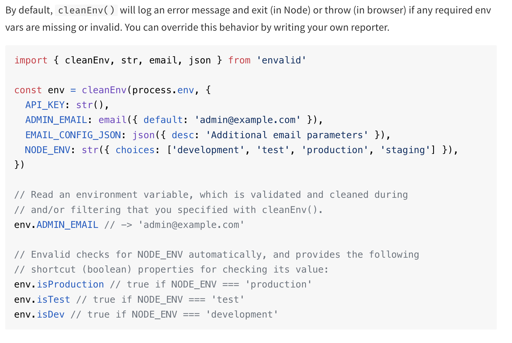

- mongoose:
    - `mongoose.Schema`: Used for defining the schema structure (capitalized).
    - `mongoose.model`: Used for creating a model from the schema (lowercase).
    - `TS` in mongoose, see note.ts
- `envalid`: see readme
- `TS` req, res:
    - `app.get("/", (req: Request, res: Response): Response => {`
    - `app.get("/", async (req: Request, res: Response): Promise<Response> => {`
    - `: Promise<Response>` - This indicates that the function returns a `Promise` that resolves to a `Response` object. 
- you cannot just do return res.status(), there must be a .json or .send or .end to send the response
# error handling in TS express routes
- every `Error` instance has a message property
- we should check that
```js
if(error instanceof Error) {
    errorMessage = error.message;
    ...
}
```
because we can throw anything not just `throw Error('boom');`
# TS
## controllers
for request handler functions for example:
```ts
router.get('/', notesController.getAllNotes);
```
can do this:
```ts
const getAllNotes: RequestHandler = async (req, res) => {...
```
- ideal way to write a getById route:
```ts
import { RequestHandler } from 'express';
import mongoose from 'mongoose';
import Note from './models/Note'; // Adjust the path as necessary

const getNoteById: RequestHandler = async (req, res) => {
    const { id } = req.params; // Use req.params for path parameters    🚨 mistake #1

    // Validate the ID format
    if (!mongoose.Types.ObjectId.isValid(id)) {     ⭐
        return res.status(400).json({ error: 'Invalid ID format' });
    }

    try {
        const note = await Note.findById(id);

        if (!note) {        ⭐
            return res.status(404).json({ error: 'Note not found' });
        }

        res.status(200).json({ note });
    } catch (error) {
        // Log the error for debugging (optional)
        console.error(error);
        res.status(500).json({ error: 'An error occurred while retrieving the note' });
    }
};
```

# Request URL - Route Parameters v/s Query Parameters
- Route parameters are parts of the URL that act as placeholders for values. They are defined in the route path and are often used to identify a specific resource.

- Query parameters are typically used to filter or modify the data being requested. They appear after a ? in the URL and are usually in the form of key-value pairs.

## example:
- Write TS code for this: we want to create a route that retrieves a specific note by its id and allows sorting through query parameters.
```ts
const getNoteCustomRoute('/')
```
# `RequestHandler<>` generic in Express
- The RequestHandler type in Express is a generic type that helps you define the types of request,
- it can be either nothing or all 4 generic parameters, i.e, either
    - `const getNote: RequestHandler = async (req, res) => {...}`
    OR
    - `const myRouteHandler: RequestHandler<RouteParams, ResponseBody, RequestBody, QueryParams> = async (req, res) => {...}`
- example:
```ts
import { RequestHandler } from 'express';

// Define types for request parameters, response body, request body, and query
interface Params {
  id: string; // e.g., for a route like /items/:id
}

interface ResponseBody {
  message: string;
}

interface RequestBody {
  title: string;
  text?: string;
}

interface Query {
  sortBy?: string;
}

// Define the route handler using the RequestHandler type
const myRouteHandler: RequestHandler<Params, ResponseBody, RequestBody, Query> = async (req, res) => {
  const { id } = req.params; // Access route parameters
  const { title, text } = req.body; // Access request body
  const { sortBy } = req.query; // Access query parameters

  // Your logic here...

  return res.status(200).json({
    message: `Note ${id} updated successfully!`,
  });
};
```

## validating mongoose object ids
```ts
   // Validate the ID format
  if (!mongoose.Types.ObjectId.isValid(id)) {
    return res.status(400).json({ error: "Invalid ID format" });
  }
```
## how to pass data between middleware functions
If you want to avoid attaching properties to `req`, you can also use `res.locals`, which is a common practice in Express for sharing data between middleware functions:
```ts
    ...
    res.locals.note = note;
    next();
  } catch (error) {
    console.error(error);
    return res.status(500).json({ error: "An error occurred while retrieving the note" });
  }
};

// Later in your route handler, you can access it like this:
const updateNote: RequestHandler = (req, res) => {
  const note = res.locals.note; // Access the note from res.locals
  return res.status(200).json({ note });
};
```

- casting:
```ts
error: (error as Error).message
```

# frontend
- in the frontend before we ƒetch notes, we should create a `note` interface, so inside src/ create a models/note.ts file which exports a note interface, then in App.tsx:
before: `const [notes, setNotes] = useState([]);`
after: `const [notes, setNotes] = useState<Note[]>([])`

- `export function NoteComponent({ note }: { note: Note }) {`

- In JavaScript, all async functions automatically return a Promise. If you return a value from an async function, that value is wrapped in a resolved Promise. If an error is thrown, it returns a Promise that is rejected with that error.

# old_README
# mern-with-typescript-practice
A responsive MERN stack note taking app with cookie sessions instead of JWT auth built with TS.

# initialization
## setting up packages with TS in mind
- mkdir backend frontend
- cd backend; npm init -y
- npm i --save-dev typescript;
- npx tsc --init        // for generating the tsconfig.json
- For TS projects we also need to install a package that contains the type related to a package so that our code works properly and TS knows what types the different functions and variables have, so:
- npm i express
- npm i --save-dev @types/express

## naming conventions and folder structure
- keep all the source code in `src`, everything outside it is for configuration


## package.json and scripts:
- required for some web hostings: "main": "dist/server.js",
- `"dev": "npx tsc; node --env-file .env --watch --trace-warnings dist/server.js"`
or install nodemon and ts-node then do:
- `"dev":"npx nodemon src/server.ts"`
- npm i -D eslint


## `envalid` package - a small library for validating and accessing environment variables in Node.js programs
- it enforces a schema on the env variables
- Type-safe: written completely in TypeScript, with great support for inference

- npm i envalid
- `envalid.cleanEnv(environment, validators, options)`
    - `environment` - An object containing your env vars (eg. process.env)
    - `validators` - An object that specifies the format of required vars.

### The following validation functions are available:

- `str()` - Passes string values through, will ensure a value is present unless a default value is given. Note that an empty string is considered a valid value - if this is undesirable you can easily create your own validator (see below)
- `bool()` - Parses env var strings "1", "0", "true", "false", "t", "f" into booleans
- `num()` - Parses an env var (eg. "42", "0.23", "1e5") into a Number
email() - Ensures an env var is an email address
host() - Ensures an env var is either a domain name or an ip address (v4 or v6)
port() - Ensures an env var is a TCP port (1-65535)
url() - Ensures an env var is a URL with a protocol and hostname
json() - Parses an env var with JSON.parse
Each validation function accepts an (optional) object with the following attributes:

`choices` - An Array that lists the admissible parsed values for the env var.
`default` - A fallback value, which will be present in the output if the env var wasn't specified. Providing a default effectively makes the env var optional. Note that default values are not passed through validation logic, they are default output values.
`devDefault` - A fallback value to use only when NODE_ENV is explicitly set and not 'production'. This is handy for env vars that are required for production environments, but optional for development and testing.
`desc` - A string that describes the env var.
`example` - An example value for the env var.
`docs` - A URL that leads to more detailed documentation about the env var.

# A crucial error debugging point in TS:
- there could be a type mismatch due to a version differnece between, npm i @types/express and npm i express, both commands install the latest versions which could be problematic, for example:
 ```sh
 npm list express @types/express                   ─╯

backend@1.0.0 /Users/yashmeena/Desktop/stuff/git repos/mern-with-typescript-practice/backend
├── @types/express@5.0.0
└── express@4.21.1
```
